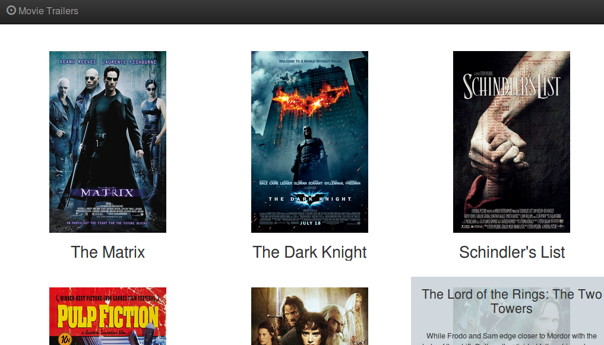

# Movie Trailer website

This is the first Project of the [Full Stack Web Developer Nanodegree Program](https://www.udacity.com/course/full-stack-web-developer-nanodegree--nd004) by **Udacity**.

The Movie Trailer Website consists of server-side code to store a list of movies titles, along with its respective box art imagery and movie trailer website. The data is served as a web page allowing visitors to review the movies and watch the trailers.




## Run the website

  - Install [Python](https://www.python.org/)
  - Clone this repository
  - Run the catalog.py file and the website shouold open in your browser:
  ```sh
$ python catalog.py
```

## Borrowed Code

Some of the code used in this project:

* [fresh_tomatoes](https://github.com/adarsh0806/ud036_StarterCode/blob/master/fresh_tomatoes.py) - starter code to generate the movie trailer website.
* [Bootstrap](http://getbootstrap.com/) - Powerful mobile first front-end framework.
* [jQuery](https://jquery.com/) - The Write Less, Do More, JavaScript Library.
* [Python.gitignore](https://raw.githubusercontent.com/github/gitignore/master/Python.gitignore) - From a collection of useful .gitignore templates
