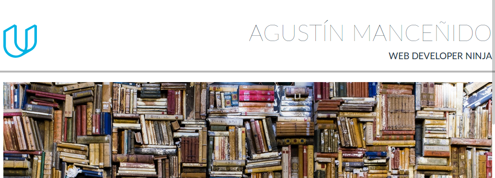

# Portfolio website

This is the 2nd Project of the [Full Stack Web Developer Nanodegree Program](https://www.udacity.com/course/full-stack-web-developer-nanodegree--nd004) by **Udacity**.

This project consits of a portfolio website built from a design mockup as a PDF-file provided by Udacity. This is responsive website that displays images, descriptions and links.

## Open website

  - Clone this repository
  - Open  the index.html with your favourite browser:

## Borrowed Code

Some of the code used in this project:

* [Normalize.css](https://necolas.github.io/normalize.css/) - makes browsers render all elements more consistently and in line with modern standards.
* [Flexbox Grid](http://flexboxgrid.com/) - A grid system based on the flex display property.

## Images

The following images where used in this project:
* [Coffee Writing](https://www.pexels.com/photo/coffee-writing-computer-blogging-34600/) from [Pexels](https://www.pexels.com/)
* [Featured Work Images](https://unsplash.com/collections/635647/flatlay) from [Unsplash](https://unsplash.com/)
