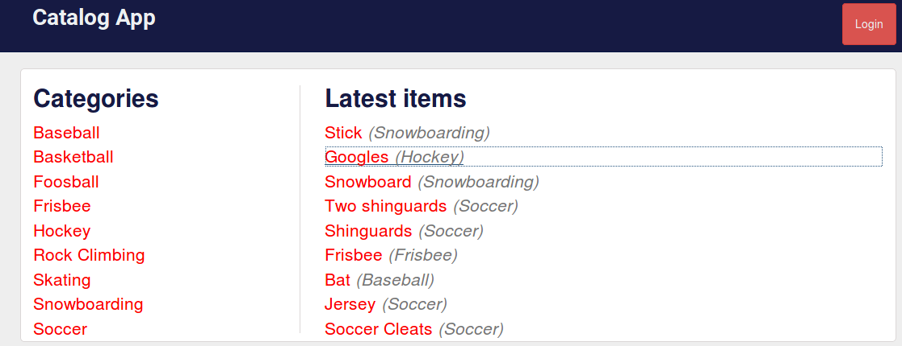

# Item Catalog Project

This is the 4th Project of the [Full Stack Web Developer Nanodegree Program](https://www.udacity.com/course/full-stack-web-developer-nanodegree--nd004) by **Udacity**.

This project consits of develop an application that provides a list of items within a variety of categories as well as provide a user registration and authentication system. Registered users will have the ability to post, edit and delete their own items.



## Run the code

  - Install [Python](https://www.postgresql.org/)
  - Clone this repository
  - Example database: ```python examplecatalog.py```.
  - Run the program: ```python application.py```.
  - Open the application in your browser: [http://localhost:8000](http://localhost:8000)

## Project Display
The Item Catalog project consists of developing an application that provides a list of items within a variety of categories, as well as provide a user registration and authentication system.

Different **views** were deveolped according to the provided [guide](https://docs.google.com/document/d/1jFjlq_f-hJoAZP8dYuo5H3xY62kGyziQmiv9EPIA7tM/pub?embedded=true):
* **[Homepage](http://localhost:8000/)** displays all current categories along with the latest added items.
* [Specific category](http://localhost:8000/catalog/Snowboarding/items) specific category shows you all the items available for that category.
* [Specific item](http://localhost:8000/catalog/Snowboarding/Snowboard)  shows you specific information of that item.
* [Google Accounts Loggin](http://localhost:8000/login). Page implements a third-party authentication & authorization service instead of implementing its own, insecure authentication & authorization spec.
* [API Endpoints](http://localhost:8000/json). The project implements a JSON endpoint that serves the same information as displayed in the HTML endpoints for an arbitrary item in the catalog.
* [CRUD: Read](http://localhost:8000/). Website reads category and item information from a database.
* [CRUD: Create](http://localhost:8000/catalog/new/). Website includes a form allowing users to add new items and correctly processes submitted forms.
* [CRUD: Update](http://localhost:8000/catalog/Stick/edit/). Website does include a form to edit/update a current record in the database table and correctly processes submitted forms.
* [CRUD: Delete](http://localhost:8000/catalog/Stick/delete/). Website does include a function to delete a current record.


## Install dependencies

    $ sudo apt install python-pip

    $ pip install sqlalchemy

    $ sudo pip install Flask

    $ sudo pip install --upgrade oah2client

    $ sudo pip install requests
