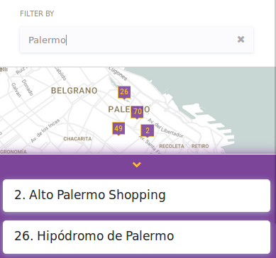

# Neighborhood Map Project

This is the 6th Project of the [Full Stack Web Developer Nanodegree Program](https://www.udacity.com/course/full-stack-web-developer-nanodegree--nd004) by **Udacity**.

This project consists of developing a single page application featuring a map of your neighborhood or a neighborhood to visit. Then add functionality to this map including highlighted locations, third-party data about those locations and various ways to browse the content.

[Click here to try it out!](https://neigborhoodmap.herokuapp.com/index.html)


----------


## Quickstart
Checkout the latest version on [Github Pages](https://github.com/nitsuga1986/UdacityP6Neighborhood-Map).
Requirements: [Node.js](https://nodejs.org/en/)  and [Bower package manager](https://bower.io/) must be installed.

1. Clone or download the repo.
2. Navigate to the repo.
    ```bash
    $> cd your_folder/UdacityP6NeighborhoodMap
    ```
3. Run `bower install` to get the project dependencies listed in bower.json.
4. Open `index.html` in your favorite browser.

----------


## Functionality Overview

### Displaying locations
By clicking on the list of locations, the map will display some information based on Foursquare API search and Google Street View:


### Current Weather
Current weather from Open Weather Map APIis always displayed in the top menu:


### Markers visibility: Polygon
Markers visibility can be modified from the top menu. Show / Hide will affect all the markers. Drawing will enable the polygon tool from Google Maps API to show only the markers included in the area:


### Filter By
The Filter by input field from the top menu allows to filter the locations list:




### Search nearby places
The Search input field from the top menu allow to find nearby places using the Places Library from Google Maps API:


----------


## APIs used in this Project


### Google Maps API
With more than one billion global monthly active users in over 200 countries, Google Maps data gives accurate real-time information for mapping, navigation and places.
#### Libraries
These are the libraries used in the developed app:
 - **Geometry**: includes utility functions for calculating scalar geometric values (such as distance and area) on the surface of the earth.
 - **Drawing**: provides a graphical interface for users to draw polygons, rectangles, polylines, circles, and markers on the map.
 - **Place**: enables your application to search for places such as establishments, geographic locations, or prominent points of interest, within a defined area. Consult the Places library documentation for more information.

### Foursquare API
The Foursquare API gives you access to our world-class places database and the ability to interact with Foursquare users and merchants.

### Open Weather Map API
Simple and fast and free weather API from OpenWeatherMap. Access to current weather data, 5- and 16-day forecasts, UV Index, air pollution and historical data.


----------


## Third-party resources
Here are some useful resoures that were used in this app:
- [Bower: A package manager for the web](https://bower.io/)
- [Design based in Hikalot app](https://github.com/jonwonglam/udacity-hikalot)
- [knockoutjs](http://knockoutjs.com/)
- [Bootstrap 4](https://getbootstrap.com/)
- [Font Awesome](http://fontawesome.io/)
